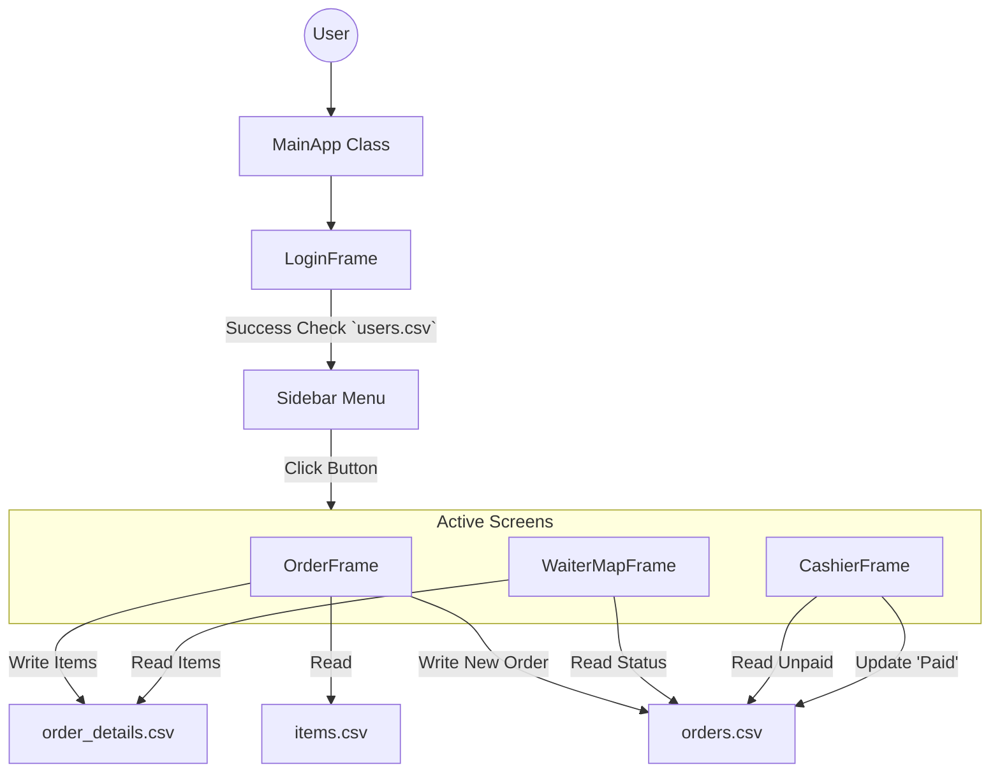

# Simplified Guide: How Your Cafe Program Works

This document explains your program in simple terms, so you can understand exactly what's happening behind the scenes without getting lost in technical jargon.

---

## 1. The Big Picture
Imagine your program is a **digital restaurant manager**. It replaces paper notebooks with a computer system.
- **The Brain (`cafeGUI.py`)**: This single file contains all the logic for the App.
- **The Memory (`data/`)**: This folder acts like a filing cabinet. It stores all your information (Menu, Orders, Users) in Excel-like CSV files.

---

## 2. The "Files" (Your Database)
Instead of a complex database, we use simple text files in the `data` folder. You can even open them with Excel!

| File Name | What it does |
| :--- | :--- |
| `items.csv` | **The Menu**. Stores lists of food/drinks, prices, and stock. |
| `orders.csv` | **The Order History**. Captures *Who* ordered, *When*, and total price. |
| `order_details.csv` | **The Item List**. Stores specifically *What* was ordered (e.g., "Chicken x2"). |
| `users.csv` | **The Staff List**. Usernames and passwords for Admin, Cashier, etc. |

---

## 3. Key Parts of the Code (The Logic)

Inside `cafeGUI.py`, we have different "Frames". Think of these as **different screens** in your app.

### A. `init_db()` → The Builder
- **What it does**: Runs immediately when you start the app.
- **Function**: It checks "Do the CSV files exist?". If not, it **creates them automatically**. This ensures your app never crashes because of a missing file.

### B. `LoginFrame` → The Doorman
- **What it does**: The first screen you see.
- **Function**: Checks if the Username/Password matches what's inside `users.csv`.
- **Role**: Decides if you are a Waiter, Cashier, or Admin, and shows you the buttons allowed for your role.

### C. `OrderFrame` → The Menu & Order Taker
- **What it does**: Where you click food pictures to order.
- **How it works**:
    1. Reads `items.csv` to show the menu.
    2. When you click "Checkout", it saves two things:
        - The **General Info** (Table 1, Total 50k) goes to `orders.csv`.
        - The **Specifics** (2x Rice, 1x Tea) go to `order_details.csv`.

### D. `WaiterMapFrame` → The Map & Tracker
- **What it does**: The interactive map with Green/Red tables.
- **How it works**:
    - It looks at `orders.csv`. If a table has an order that isn't "Selesai" (Finished), it turns **Red**.
    - When you click a table, it acts like a detective:
        1. Finds the Order ID for that table.
        2. Looks up `order_details.csv` to find exactly what food belongs to that ID.
        3. Shows you the list (e.g., "- Chicken x1").

### E. `CashierFrame` → The Cashier
- **What it does**: Handles measurements and payments.
- **How it works**:
    - Shows all orders that are **Unpaid**.
    - When you click "Bayar" (Pay), it updates the status in `orders.csv` from "Unpaid" to "Paid".
    - It generates a QR code and prints a text receipt (`.txt` file).

### F. `MainApp` → The Boss
- **What it does**: The main window frame.
- **Function**: It controls everything. When you switch screens (from Login to Map), this class destroys the old screen and builds the new one.

---

## 4. The Workflow Example

1. **Waiter** logs in.
2. Goes to **Buat Pesanan** (`OrderFrame`), clicks "Chicken" and "Table 1".
3. **System** saves this to `orders.csv` (Status: Unpaid, Progress: Belum Dibuat) and `order_details.csv`.
4. **Kitchen** sees the order on the Map (`WaiterMapFrame`), clicks Table 1, sees "Chicken", and cooks it.
5. **Kitchen** updates status to "Siap Diantar".
6. **Cashier** sees the order in **Proses Pembayaran** (`CashierFrame`), takes money, and marks it "Paid".
7. **Waiter** sees table is "Paid" and clears the table (sets to "Selesai"), making the table **Green** again.

---

## 5. Deep Dive: Code Architecture & Flow
This section explains exactly **how** the code connects together, line-by-line.

### A. The Architecture (Visualized)
This diagram shows how your Python classes "talk" to your data files.

### B. How the Code "Links" Together

#### 1. The Startup Link (`MainApp`)
- **Code**: `app = MainApp(); app.mainloop()` (Bottom of file)
- **Flow**:
    1. `MainApp` starts.
    2. Calls `init_db()` immediately to ensure `data/` folders exist.
    3. Calls `self.show_login()` to load the first screen.

#### 2. The Login Link (`LoginFrame` -> `MainApp`)
- **The Link**: `callback` function.
- **How it works**:
    - `MainApp` passes a function `self.on_login` to `LoginFrame`.
    - When you click "LOGIN" inside `LoginFrame`, it calls `self.do_login(callback)`.
    - If password is correct, it triggers `callback(...)`.
    - **Result**: `MainApp` destroys the Login screen and builds the Dashboard (`on_login` function).

#### 3. The Data Link (`get_df` & `save_df`)
- **The Glue**: These two functions are the **only** way your code talks to files.
- **Why**: Instead of writing `pd.read_csv(...)` 50 times, we write it once in `get_df`.
- **Flow**:
    - `df = get_df("items")` → Opens `data/items.csv`.
    - You modify `df`.
    - `save_df("items", df)` → Saves it back to Excel format.

#### 4. The Order Logic Flow (`OrderFrame`)
This is the most complex part. Here is the chain reaction when you click "Checkout":

1. **User Action**: Click "CHECKOUT".
2. **Function**: `self.checkout()` runs.
    - **Step A (Master Record)**: Creates a new row for `orders.csv`.
        - Generates `order_id` (e.g., "a1b2c3d4"). **This ID is the key link**.
        - Saves Total Price, Date, and Customer Name.
    - **Step B (Detail Records)**: Loops through your cart.
        - For every item (e.g., Chicken), it creates a row in `order_details.csv`.
        - **Crucial Link**: It saves the SAME `order_id` ("a1b2c3d4") in these rows. This is how we know "This Chicken belongs to Order a1b2c3d4".

#### 5. The Map Logic Flow (`WaiterMapFrame`)
How does the map know a table is full?
1. **Refresh**: `refresh_map()` is called.
2. **Query**: It reads `orders.csv`.
3. **Filter**: It looks for rows where `status` is NOT "Selesai".
    - `active = df[order_progress != 'Selesai']`
4. **Match**: It gets the list of occupied tables (e.g., ["Meja 1"]).
5. **Draw**: It loops 1 to 9. If "Meja 1" is in the list, it draws **RED**. Else **GREEN**.

### C. Variable Links
Here are the specific variable names that connect everything:

- **`order_id`**: The most important variable.
    - Created in `OrderFrame.checkout()`.
    - Saved in `orders.csv` (Column: `order_id`).
    - Saved in `order_details.csv` (Column: `order_id`).
    - Used in `WaiterMapFrame` to lookup items: `df_details[df_details['order_id'] == target_id]`.
    - Used in `CashierFrame` to find what to pay.

- **`table_name`** (e.g., "Meja 1"):
    - Selected in `OrderFrame` (saved as `customer`).
    - Used in `TableMap` to turn buttons red/green.
    - Linked to `orders.csv` column `customer`.
